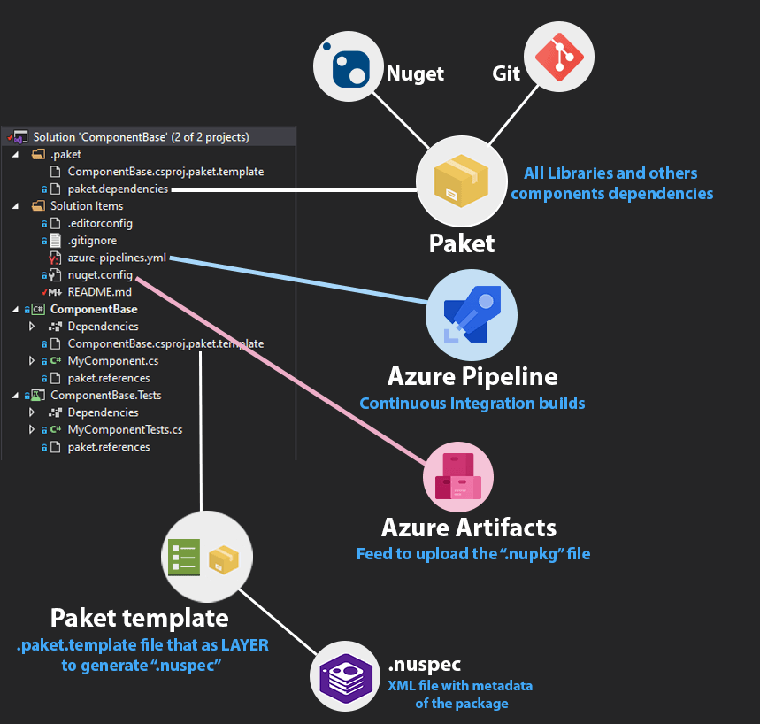

# ComponentBase Component/Library

[](https://dev.azure.com/opitblast/CsharpComponentBase/_build/latest?definitionId=20&branchName=master)

This is a **nuget/paket** main scaffold component to create others packages

## Requirements

* ### [.NET Core](https://dotnet.microsoft.com/download)
  > Build and run tests

* ### [Nuget CLI](https://chocolatey.org/packages/NuGet.CommandLine/5.6.0)
  > .NET official package manager to generate **```.nupkg```** file

* ### [Paket](https://fsprojects.github.io/Paket/index.html)
  > Integrated with [Nuget]() to manage dependencies, with more clear files and allow use **Git** dependencies


## Getting Started

### 1. Install [.NET Core](https://cakebuild.net/docs/tutorials/getting-started)

  - Use [Chocolatey](https://chocolatey.org/)

    ```bash
    choco install dotnetcore-sdk
    ```
    Or download from https://dotnet.microsoft.com/download
  
  - Restart your terminal and check if the cli `dotnet` is in your `$PATH` environment variable

### 2. Install [Nuget](https://chocolatey.org/packages/NuGet.CommandLine/5.6.0)

Use [Chocolatey](https://chocolatey.org/)

```bash
  choco install nuget.commandline
```

#### 2.1 Install [Azure Artifacts Credential Provider](https://github.com/microsoft/artifacts-credprovider)

  Optionally, you can install with [Chocolatey](https://chocolatey.org/) too

  ```bash
  # Install nuget AUTH PROVIDER
  # to push package for feed authenticate
  choco install nuget-credentialprovider-vss
  ```
  > This is required to push ```.nupkg``` packages to **Azure Artifacts**

### 3. Install [Paket](https://fsprojects.github.io/Paket/index.html)

Use [.NET Core tools](https://docs.microsoft.com/en-us/dotnet/core/tools/global-tools#install-a-local-tool) to install **paket** command line locally

```bash
  dotnet tool restore
```

#### 3.1 Install Azure pipelines CLI (OPTIONAL) 

Use [Chocolatey](https://chocolatey.org/)

```bash
  # Install base Azure command line
  choco install azure-cli

  # Install Azure Devops extensions
  az extension add --name azure-devops
```

### 4. Install all DEPENDENCIES and restore references

```bash
  dotnet paket restore
  dotnet restore
```

### 5. Build and test the solution

```bash
  # Build the solution
  dotnet build

  # Run all tests
  dotnet test
```

## Project structure

Your project folders structure should be:

- 📂 __ComponentBase__
  > The .NET solution group projects
   - 📄 [ComponentBase.sln](ComponentBase.sln)
   - 📂 __ComponentBase.Tests__
      > The project with Unit and/or Integration tests
     - 📄 [ComponentBase.Tests.csproj](ComponentBase.Tests/ComponentBase.Tests.csproj)
   - 📂 __ComponentBase__
      > The project with your library/component
     - 📄 [ComponentBaseComponent.csproj](ComponentBaseComponent/ComponentBaseComponent.csproj)
  



## Generating package (```.nupkg```)

1. Make sure that project builds and all tests are passed
   
    ```bash
    # Build the solution
    dotnet build

    # Run all tests
    dotnet test
    ```
2. Genarate the ```.nupkg``` file

    ```bash
      # Pack your component to the path nugets/*.nupkg
      dotnet pack --include-symbols --configuration Release --output nugets [your-component-project]
    ```
    > **PS:** If you not pass the **_--outputs_** flag, the ```.nupkg``` file is generated in: ```[your-component-project]/bin/Release``` by default 

## Publish to Azure Devops

1. Restore the project to provide authentication

    ```bash
      nuget restore
    ```

2. Push to the **Azure Artifacts** feed

    ```bash
      # See the nuget.config file <packageSources> tag
      nuget push -Source "[your-feed-name]" -ApiKey az [path/to/nupkg-file].nupkg
    ```
