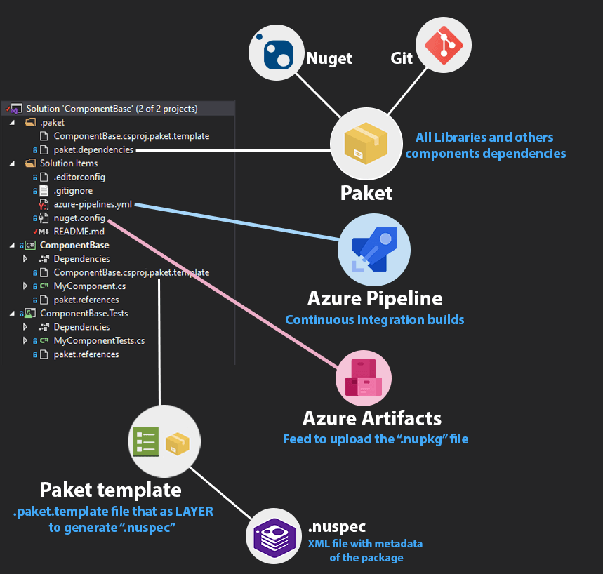
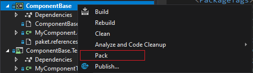
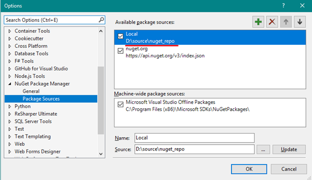
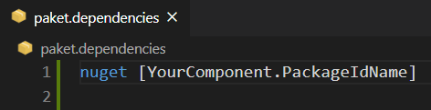
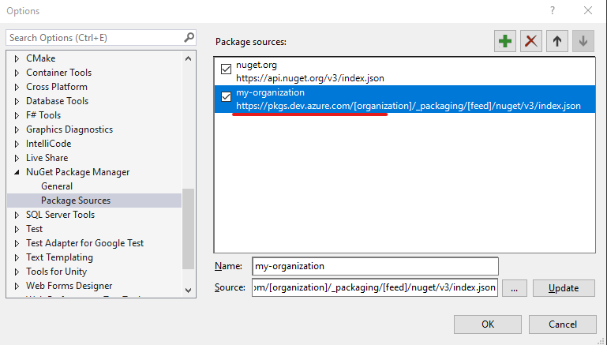

# ComponentBase Component/Library

[](https://dev.azure.com/opitblast/CsharpComponentBase/_build/latest?definitionId=20&branchName=master)

This is a **nuget/paket** main scaffold component to create others packages

## Requirements

* ### [.NET Core](https://dotnet.microsoft.com/download)
  > Build and run tests

* ### [Nuget CLI (Command Line)](https://chocolatey.org/packages/NuGet.CommandLine/5.6.0)
  > .NET official package manager to generate **```.nupkg```** file

* ### [Paket](https://fsprojects.github.io/Paket/index.html)
  > Integrated with [Nuget](https://www.nuget.org) to manage dependencies, with more clear files and allow use **Git** dependencies


## Getting Started

### 1. Install [.NET Core](https://cakebuild.net/docs/tutorials/getting-started)

  - Use [Chocolatey](https://chocolatey.org/)

    ```bash
    choco install dotnetcore-sdk
    ```
    Or download from https://dotnet.microsoft.com/download
  
  - Restart your terminal and check if the cli `dotnet` is in your `$PATH` environment variable

### 2. Install [Nuget](https://chocolatey.org/packages/NuGet.CommandLine/5.6.0)

Use [Chocolatey](https://chocolatey.org/)

```bash
  choco install nuget.commandline
```

#### 2.1 Install [Azure Artifacts Credential Provider](https://github.com/microsoft/artifacts-credprovider)

  Optionally, you can install with [Chocolatey](https://chocolatey.org/) too

  ```bash
  # Install nuget AUTH PROVIDER
  # to push package for feed authenticate
  choco install nuget-credentialprovider-vss
  ```
  > This is required to push ```.nupkg``` packages to **Azure Artifacts**

### 3. Install [Paket](https://fsprojects.github.io/Paket/index.html)

Use [.NET Core tools](https://docs.microsoft.com/en-us/dotnet/core/tools/global-tools#install-a-local-tool) to install **paket** command line locally

```bash
  dotnet tool restore
```

#### 3.1 Install Azure pipelines CLI (OPTIONAL) 

Use [Chocolatey](https://chocolatey.org/)

```bash
  # Install base Azure CLI (command line)
  choco install azure-cli

  # Install Azure Devops extensions
  az extension add --name azure-devops
```

### 4. Install all DEPENDENCIES and restore references

```bash
  dotnet paket restore
  dotnet restore
```

### 5. Build and test the solution

```bash
  # Build the solution
  dotnet build

  # Run all tests
  dotnet test
```

## Project structure

Your project folders structure should be:

- 📂 __ComponentBase__
  > The .NET solution group projects
   - 📄 [ComponentBase.sln](ComponentBase.sln)
   - 📂 __ComponentBase.Tests__
      > The project with Unit and/or Integration tests
     - 📄 [ComponentBase.Tests.csproj](ComponentBase.Tests/ComponentBase.Tests.csproj)
   - 📂 __ComponentBase__
      > The project with your library/component
     - 📄 [ComponentBaseComponent.csproj](ComponentBaseComponent/ComponentBaseComponent.csproj)
  


## Generating package (```.nupkg```)

1. Make sure that project builds and all tests are passed
   
    ```bash
    # Build the solution
    dotnet build

    # Run all tests
    dotnet test
    ```
2. Genarate the ```.nupkg``` file

    ```bash
      # Pack your component to the path nugets/*.nupkg
      dotnet pack --include-symbols --configuration Release --output nugets [your-component-project]
    ```
    > **PS:** If you not pass the **_--outputs_** flag, the ```.nupkg``` file is generated in: ```[your-component-project]/bin/Release``` by default

    Or use Visual Studio and right click on your project component under Solution explorer, and click **Pack**.

    

## Testing your package locally

1. After [generated the `.nupkg`](#generating-package-nupkg) file, create a folder accessible to you (local directory or network share) as package repo:

    Publish the package to local repo using `nuget add`:

    ```bash
      nuget add [my-component.{version-number}].nupkg -source [your/local-repo/directory]
    ```
2. Using [Paket](https://fsprojects.github.io/Paket/index.html), add your local folder like a `source` to the `paket.dependencies` file, in a project/application that will use this package like a dependency:

   ```bash
    source D:\source\nuget_repo
    source ~/source/nuget_repo
    source \\server\nuget_repo

    # Paket supports relative directory to the paket.dependencies too
    source directory/relative/to/paket.dependencies
   ```
  
   If your destiny project/application uses only [Nuget](https://www.nuget.org) like a package manager (without **`Paket`**), you can add the nuget repo folder mentioned above with **Visual Studio**:

   

   For more information, see these tutorials:

   - [Testing NuGet packages locally](https://blog.verslu.is/nuget/testing-nuget-packages-locally)
   - [Creating and using a local NuGet package repository](https://medium.com/@churi.vibhav/creating-and-using-a-local-nuget-package-repository-9f19475d6af8)


## Publish to Azure Devops/Artifacts

1. Restore the project to provide authentication

    ```bash
      nuget restore
    ```

2. Push to the **Azure Artifacts** feed

    ```bash
      # See the nuget.config file <packageSources> tag
      nuget push -Source "[your-feed-name]" -ApiKey az [path/to/nupkg-file].nupkg
    ```

## Install remote package to an application

1. Using [Paket](https://fsprojects.github.io/Paket/index.html), add your **remote feed URL** like a `source` to the `paket.dependencies` file, in a project/application that will use this package like a dependency:

   ```bash
    source https://pkgs.dev.azure.com/opitblast/_packaging/opitblast/nuget/v3/index.json

    # Paket supports relative directory to the paket.dependencies too
    source directory/relative/to/paket.dependencies
   ```

2. Add the **packageId** like a dependency into `paket.dependencies` file of your application:
  
    
 
    If your destiny project/application uses only [Nuget](https://www.nuget.org) like a package manager (without **`Paket`**), you can add the **remote feed URL** mentioned above with **Visual Studio**:

    

    Where:

    - **[organization]**: replace with your organization name defined in Azure Devops
    - **[feed]**: replace with your private feed (by organization or project) where the package that will be used like an dependency was uploaded.

    For more information, see this official Microsoft tutorial:

   - [Visual Studio Package Sources](https://docs.microsoft.com/en-us/nuget/consume-packages/install-use-packages-visual-studio#package-sources)
